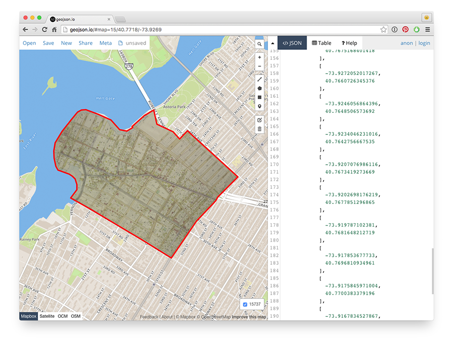
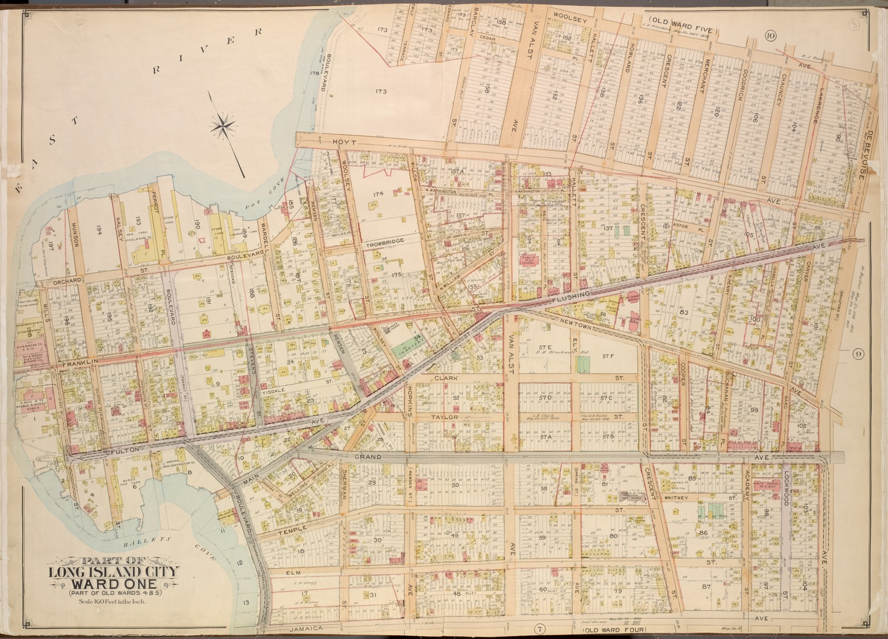
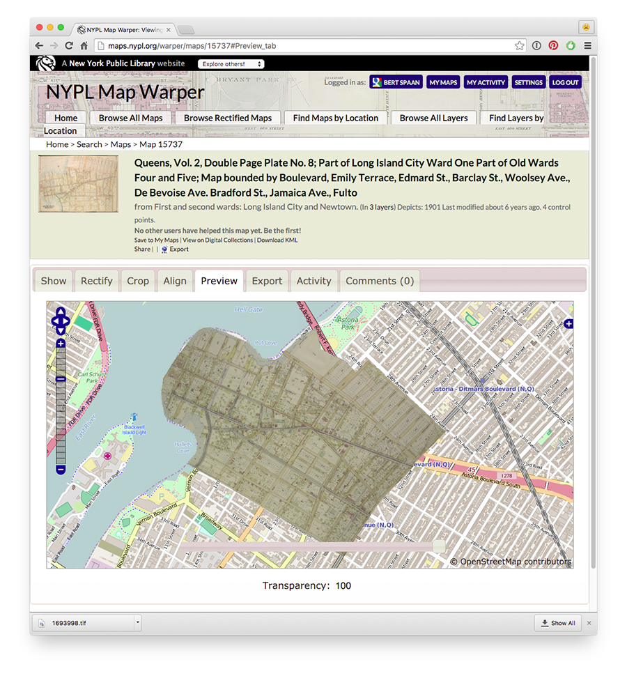
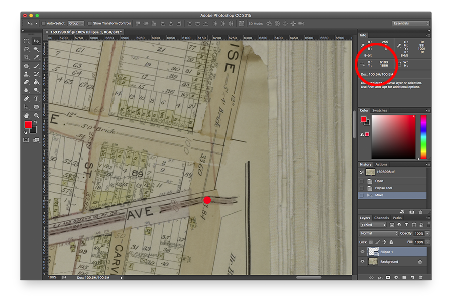

# mask-to-geojson

mask-to-geojson converts Mapwarper GML masks to GeoJSON polygons, using [gdaltransform](http://www.gdal.org/gdaltransform.html). Given a map ID, mask-to-geojson reads the map's mask and ground control points (GCPs) from the Mapwarper API and transforms the mask's pixel coordinates to latitude/longitude coordinates.



## Installation

As a Node.js module:

`npm install --save nypl-spacetime/mask-to-geojson`

As a standalone command line tool:

`npm install -g nypl-spacetime/mask-to-geojson`

## Usage

As a Node.js module:

```js
var maskToGeoJSON = require('mask-to-geojson')

maskToGeoJSON.getMaskAndTransform({
  mapId: 27378
}, (err, geojson) => {
  if (err) {
    console.error(err)
  } else {
    console.log(JSON.stringify(geojson))    
  }
})
```

As a standalone command-line tool:

```
mask-to-geojson 27378
```

## How!?!?!?

Like this!

For example, take this 1901 map of Long Island City:

[](http://maps.nypl.org/warper/maps/15737#Show_tab)

Using NYPL's Mapwarper, this map is both [georectified](http://maps.nypl.org/warper/maps/15737#Rectify_tab) and [cropped](http://maps.nypl.org/warper/maps/15737#Crop_tab):

[](http://maps.nypl.org/warper/maps/15737#Preview_tab)

Mapwarper has an API endpoint for GCPs and cropping masks:

- http://maps.nypl.org/warper/maps/15737/gcps.json
- http://maps.nypl.org/shared/masks/15737.gml

Because the mask is in pixel coordinates of the original TIFF file, we need to use [gdaltransform](http://www.gdal.org/gdaltransform.html) to convert the mask to geographic coordinates with the map's GCPs as command line arguments:

```
gdaltransform -gcp 3831.7098930481, 1242.09759358287, 40.7745047932, -73.923830011 -gcp 3868.59759358287, 3395.41711229945, 40.7697272423, -73.9278640533 -gcp 2416.14438502671, 3340.0855614973, 40.7719373086, -73.9321985031 -gcp 2416.14438502669, 1214.43181818179, 40.7765847081, -73.9281215454
```

Now, inputting pixel coordinates `6183 1866` (Astoria Boulevard & 31st Street) yields the output [`40.7697658590603 -73.9178309436292`](http://www.openstreetmap.org/search?query=40.7697658590603%2C%20-73.9178309436292#map=19/40.76977/-73.91783)!



## Installing GDAL

On MacOS:

    brew install gdal

On Ubuntu:

    sudo apt-get install gdal-bin

## See also

- [NYPL Map Warper](http://maps.nypl.org/warper/)
- [gdaltransform](http://www.gdal.org/gdaltransform.html)
- [Space/Time Directory](http://spacetime.nypl.org/)
